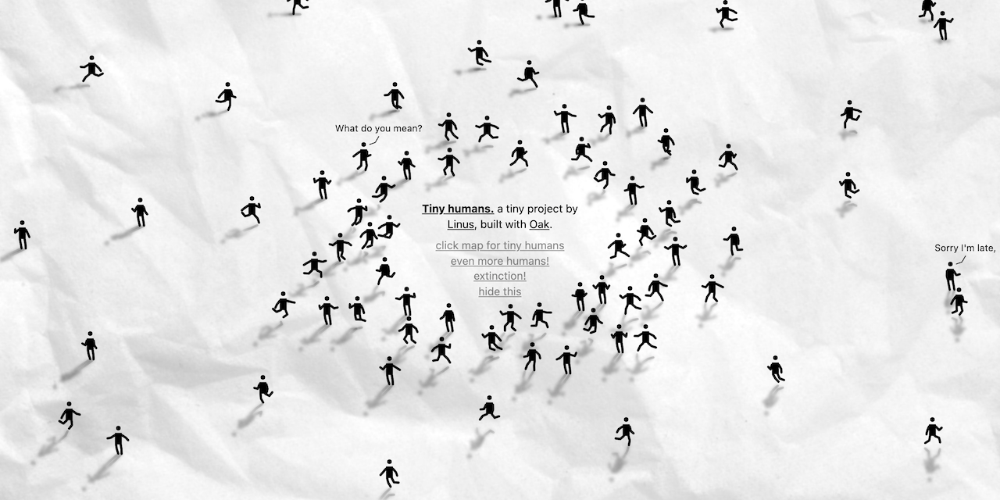
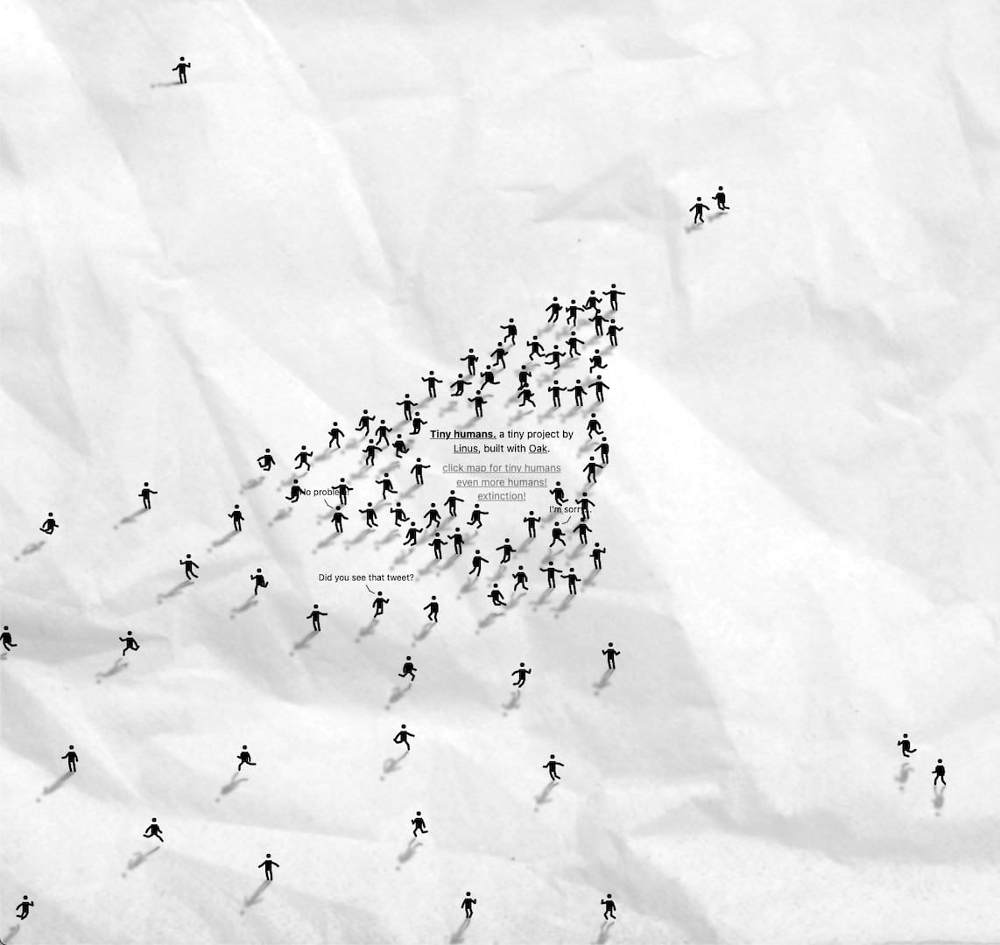
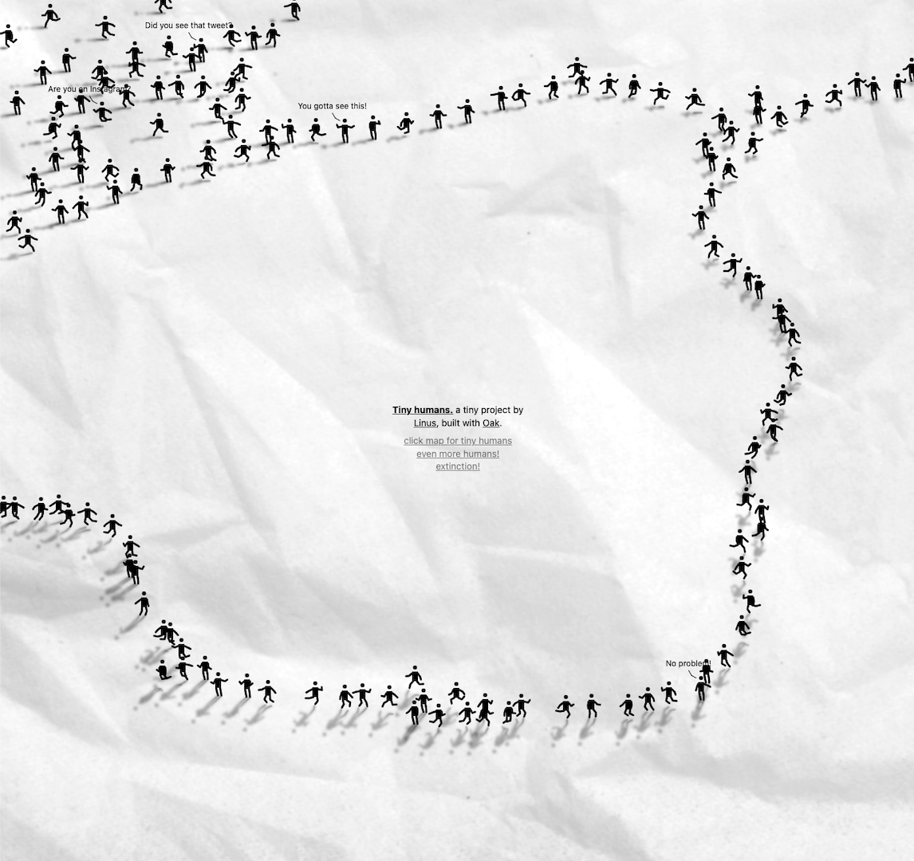

# Tiny humans 🌏

**[Tiny humans](https://tinyhumans.vercel.app/)** is a weekend hack inspired by [this Instagram post](https://www.instagram.com/p/CVETyGQK2c-/). It's an interactive little sandbox world with tiny people and their tiny conversations. Play with it at [tinyhumans.vercel.app](https://tinyhumans.vercel.app) or check out the [gallery](#tiny-humans-gallery) below for some ideas.

Tiny humans is written entirely in [Oak](https://oaklang.org/), my programming language that conveniently compiles to JavaScript — you can read the whole source [here](main.oak). It renders everything using basic 2D Canvas APIs, and uses a custom algorithm to generate humans and their shadows. The background texture is from [@marjanblan's Unsplash](https://unsplash.com/photos/_kUxT8WkoeY).



## Build and deploy

Tiny humans is written in [Oak](https://oaklang.org/). To develop or modify it, you'll need to [install the `oak` tool from the repository](https://github.com/thesephist/oak). With it installed:

- **Run a server.** Tiny humans is a static single-page app. Use any web server (like `node-static` or `python -m http.Server`) to serve the project directory. I use `python -m http.Server 10009` and go to `localhost:10009`.
- **Build the program.** The entire Oak source code for Tiny humans is in `main.oak`. To compile it into `bundle.js` which the app loads, run
	```sh
	oak build --entry main.oak --output bundle.js --web
	```
	That `--web` tells `oak` to compile our program to JavaScript. I usually run a variation of this while developing so that the code re-compiles on every change to my file. There are lots of ways to do this, but I use `entr`:
	```sh
	ls *.oak | entr -cr oak build --entry main.oak -o bundle.js --web
	```
- **Auto-format code**. Oak has a code auto-formatter built in, called `oak fmt`. To re-format `main.oak`, run
	```sh
	oak fmt main.oak --fix
	# or
	oak fmt --fix -- main.oak
	```
	The `--fix` tells `oak` to fix up the file in-place. Using `--diff` instead won't change the file, but instead show any needed changes in your terminal.

## Tiny humans gallery

>Did you make something cool with Tiny humans? Do share it with me at [@thesephist](https://twitter.com/thesephist), I'd love to see :)

Tiny humans line up in formation, and a couple of leaders forge ahead into the unknown.



A tiny human battle is about to break out! Battlefronts form, and the first few brave souls make their moves.


A tiny human line forms for people waiting to join a tiny human circle. What for? That, I do not know.


